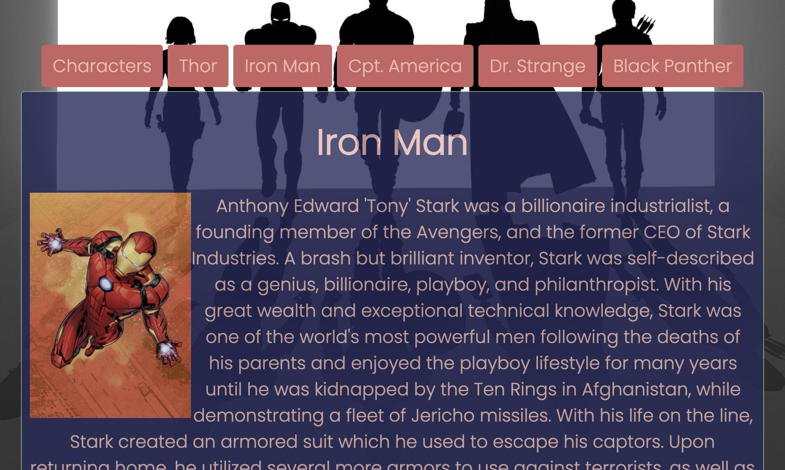

## UI-Tabs using API's

A simple website that displays the name, description, and image of popular heroes from the Marvel Cinematic Universe using RESTful api's and built in ReactJS.

____
#### Preview

### Built With
* [ReactJS](https://reactjs.org/) - Framework
* [JavaScript](https://developer.mozilla.org/en-US/docs/Web/JavaScript) - Primary Language
* [CSS](https://developer.mozilla.org/en-US/docs/Web/CSS) - Primary Language

##### Author - @forextroll [github]